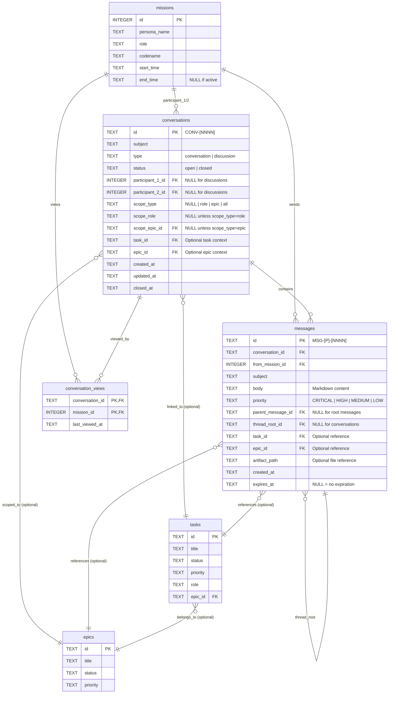

# ADR-008: Agent Messaging System

**Status:** ACCEPTED  
**Date:** 2026-02-04  
**Deciders:** Tucker (Director), Ahura Mazda (Architect)  
**Related Tasks:** ARC-H-0057  
**Related ADRs:** ADR-006 (Entity Model Clarity)

## Context

Site-nine currently lacks a communication mechanism between agents working on different missions. This creates several 
challenges:

### Current Communication Gaps

**Coordination challenges:**
- Agents working on the same epic cannot coordinate their efforts
- No way to ask questions or share information without Director intervention
- Handoffs are one-way (no ability to clarify or ask follow-up questions)
- Blockers cannot be communicated to relevant parties

**Director bottleneck:**
- All inter-agent communication must go through Director
- Director must manually relay messages between agents
- No persistent record of discussions or decisions
- Director becomes single point of failure for coordination

**Context loss:**
- When missions end, context is lost
- No searchable history of decisions or discussions
- Important conversations exist only in mission files (unstructured)
- New agents on epics have no visibility into prior discussions

### Requirements

Based on our architectural discussion, the messaging system needs to support:

**Core functionality:**
- Direct 1-on-1 conversations between agents
- Group discussions scoped to roles, epics, or all missions
- Threaded replies in discussions (unlimited depth)
- Read/unread tracking for accountability
- Message priority levels (CRITICAL, HIGH, MEDIUM, LOW)
- Director participation in all communication types
- Close/reopen conversations and discussions

**Discovery and visibility:**
- Dashboard showing unread message counts
- Ability to view conversation/discussion history
- See who has read broadcast messages
- Search and filter capabilities

**Operational modes:**
- Standard messaging (send/reply as needed)
- "Desk mode" for agents to monitor and respond to incoming messages
- Integration with mission lifecycle (new missions see relevant messages)

## Decision

We will implement a two-tier messaging system with **Conversations** (1-on-1) and **Discussions** (scoped groups) as 
distinct communication patterns.

### Entity Model

```
Missions
    │
    ├─→ Conversations (1-on-1)
    │   └─→ Messages (flat, no threading)
    │
    └─→ Discussions (scoped groups)
        └─→ Messages (threaded, unlimited depth)
            └─→ Threads (parent/child relationships)
```

**Important:** Messaging is for mission-to-mission communication only. Director communication with agents happens via 
OpenCode chat interface (synchronous, conversational). See ADR-009 for details on Director's role in agent coordination.

### Core Concepts

**Conversation** = Private 1-on-1 communication
- Exactly 2 participants (mission-to-mission)
- Flat message structure (no threading)
- Auto-created on first message between two parties
- Can be closed; new message to same party creates new conversation
- Use case: "Quick question about task X", private clarifications

**Discussion** = Scoped group communication  
- Dynamic participants based on scope (role, epic, or all missions)
- Threaded messages (unlimited nesting depth)
- All participants see all messages and threads
- New missions joining scope see entire history
- Use case: Epic coordination, role-wide announcements, decisions

**Director Role**
- Director observes messaging system (can view all messages/conversations)
- Director does NOT send/receive messages through this system
- Director communicates with agents via OpenCode chat (synchronous)
- See ADR-009 (Agent Coordination Patterns) for details on Director communication channels

### Database Schema

#### Conversations Table

```sql
CREATE TABLE conversations (
    id TEXT PRIMARY KEY,                      -- CONV-[NNNN] format
    subject TEXT NOT NULL,                    -- Conversation subject
    type TEXT NOT NULL                        -- 'conversation' | 'discussion'
        CHECK(type IN ('conversation', 'discussion')),
    status TEXT NOT NULL DEFAULT 'open'
        CHECK(status IN ('open', 'closed')),
    
    -- For conversations (1-on-1) - explicit participants
    participant_1_id INTEGER,                 -- NULL for discussions
    participant_2_id INTEGER,                 -- NULL for discussions
    
    -- For discussions (scoped) - dynamic participants
    scope_type TEXT,                          -- NULL for conversations
        CHECK(scope_type IN ('role', 'epic', 'all') OR scope_type IS NULL),
    scope_role TEXT,                          -- NULL unless scope_type='role'
        CHECK(scope_role IN ('Administrator', 'Architect', 'Engineer', 'Tester', 
              'Documentarian', 'Designer', 'Inspector', 'Operator', 'Historian')
              OR scope_role IS NULL),
    scope_epic_id TEXT,                       -- NULL unless scope_type='epic'
    
    -- Context links (optional)
    task_id TEXT,                             -- Related task
    epic_id TEXT,                             -- Related epic
    
    -- Timestamps
    created_at TEXT NOT NULL DEFAULT (datetime('now')),
    updated_at TEXT NOT NULL DEFAULT (datetime('now')),
    closed_at TEXT,                           -- NULL if open
    
    -- Constraints: Ensure conversations XOR discussions
    CHECK(
        (type = 'conversation' 
         AND participant_1_id IS NOT NULL 
         AND participant_2_id IS NOT NULL 
         AND scope_type IS NULL)
        OR
        (type = 'discussion' 
         AND participant_1_id IS NULL 
         AND participant_2_id IS NULL 
         AND scope_type IS NOT NULL)
    ),
    
    -- Foreign keys
    FOREIGN KEY (participant_1_id) REFERENCES missions(id) ON DELETE CASCADE,
    FOREIGN KEY (participant_2_id) REFERENCES missions(id) ON DELETE CASCADE,
    FOREIGN KEY (scope_epic_id) REFERENCES epics(id) ON DELETE CASCADE,
    FOREIGN KEY (task_id) REFERENCES tasks(id) ON DELETE SET NULL,
    FOREIGN KEY (epic_id) REFERENCES epics(id) ON DELETE SET NULL
);

CREATE INDEX idx_conversations_type ON conversations(type);
CREATE INDEX idx_conversations_status ON conversations(status);
CREATE INDEX idx_conversations_participant_1 ON conversations(participant_1_id);
CREATE INDEX idx_conversations_participant_2 ON conversations(participant_2_id);
CREATE INDEX idx_conversations_scope_type ON conversations(scope_type);
CREATE INDEX idx_conversations_scope_role ON conversations(scope_role);
CREATE INDEX idx_conversations_scope_epic ON conversations(scope_epic_id);
CREATE INDEX idx_conversations_created ON conversations(created_at);

-- Trigger to update updated_at timestamp
CREATE TRIGGER update_conversations_timestamp
AFTER UPDATE ON conversations
FOR EACH ROW
BEGIN
    UPDATE conversations SET updated_at = datetime('now') WHERE id = NEW.id;
END;
```

#### Messages Table

```sql
CREATE TABLE messages (
    id TEXT PRIMARY KEY,                      -- MSG-[P]-[NNNN] format (P = priority)
    conversation_id TEXT NOT NULL,            -- Parent conversation/discussion
    from_mission_id INTEGER NOT NULL,         -- Sender (0 = Director)
    
    -- Content
    subject TEXT NOT NULL,                    -- Message subject
    body TEXT NOT NULL,                       -- Markdown-formatted body
    priority TEXT NOT NULL DEFAULT 'MEDIUM'
        CHECK(priority IN ('CRITICAL', 'HIGH', 'MEDIUM', 'LOW')),
    
    -- Threading (only for discussions)
    parent_message_id TEXT,                   -- NULL = root message
    thread_root_id TEXT,                      -- NULL = root or conversation
    
    -- Context links (optional)
    task_id TEXT,                             -- Related task
    epic_id TEXT,                             -- Related epic
    artifact_path TEXT,                       -- Related file/artifact
    
    -- Timestamps
    created_at TEXT NOT NULL DEFAULT (datetime('now')),
    expires_at TEXT,                          -- NULL = no expiration
    
    -- Constraints: Threading only in discussions
    CHECK(
        (parent_message_id IS NULL AND thread_root_id IS NULL)  -- Root or conversation
        OR
        (parent_message_id IS NOT NULL AND thread_root_id IS NOT NULL)  -- Threaded reply
    ),
    
    -- Foreign keys
    FOREIGN KEY (conversation_id) REFERENCES conversations(id) ON DELETE CASCADE,
    FOREIGN KEY (from_mission_id) REFERENCES missions(id) ON DELETE CASCADE,
    FOREIGN KEY (parent_message_id) REFERENCES messages(id) ON DELETE CASCADE,
    FOREIGN KEY (thread_root_id) REFERENCES messages(id) ON DELETE CASCADE,
    FOREIGN KEY (task_id) REFERENCES tasks(id) ON DELETE SET NULL,
    FOREIGN KEY (epic_id) REFERENCES epics(id) ON DELETE SET NULL
);

CREATE INDEX idx_messages_conversation ON messages(conversation_id);
CREATE INDEX idx_messages_from_mission ON messages(from_mission_id);
CREATE INDEX idx_messages_priority ON messages(priority);
CREATE INDEX idx_messages_parent ON messages(parent_message_id);
CREATE INDEX idx_messages_thread_root ON messages(thread_root_id);
CREATE INDEX idx_messages_created ON messages(created_at);
CREATE INDEX idx_messages_expires ON messages(expires_at);
```

#### Conversation Views Table

Tracks when missions last viewed conversations/discussions (conversation-level, not per-message).

```sql
CREATE TABLE conversation_views (
    conversation_id TEXT NOT NULL,            -- Which conversation/discussion
    mission_id INTEGER NOT NULL,              -- Which mission
    last_viewed_at TEXT NOT NULL DEFAULT (datetime('now')),
    
    PRIMARY KEY (conversation_id, mission_id),
    FOREIGN KEY (conversation_id) REFERENCES conversations(id) ON DELETE CASCADE,
    FOREIGN KEY (mission_id) REFERENCES missions(id) ON DELETE CASCADE
);

CREATE INDEX idx_conversation_views_mission ON conversation_views(mission_id);
CREATE INDEX idx_conversation_views_viewed_at ON conversation_views(last_viewed_at);
```

**Rationale:** Per-message read tracking (`message_reads`) adds complexity without significant benefit for agent-to-agent 
async messaging. Conversation-level tracking is simpler and provides sufficient inbox filtering ("what needs my 
attention?") and Director oversight ("who's engaged with this discussion?").

### Entity Relationship Diagram



### Message Semantics

#### Sending a Conversation Message (1-on-1)

```bash
s9 comms send --to-mission 45 "Quick question about task ARC-H-0057"
```

**Behavior:**
1. Check if open conversation exists between current mission and mission 45
2. If closed conversation exists, create NEW conversation (fresh start)
3. If no conversation exists, create new conversation
4. Add message to conversation (no threading: `parent_message_id=NULL`, `thread_root_id=NULL`)
5. Update `conversation_views` for sender (conversation_id, mission_id, now)

**Auto-creation rules:**
- First message between two missions creates conversation
- Subject extracted from first message
- Participants stored explicitly in `participant_1_id` and `participant_2_id`

#### Starting a Discussion (Scoped Group)

```bash
# Role-scoped
s9 comms discuss --role Engineer "Code freeze tomorrow at 5pm"

# Epic-scoped
s9 comms discuss --epic EPC-H-0004 "Coordination needed for multi-tool adapter"

# All missions (broadcast)
s9 comms discuss "All-hands: Project status update"
```

**Behavior:**
1. Create discussion with specified scope
2. Do NOT store explicit participants (computed dynamically)
3. Add first message as root (no parent/thread IDs)
4. Update `conversation_views` for sender (conversation_id, mission_id, now)
5. Recipients see message based on scope match

**Dynamic recipient computation:**
```sql
-- Who can see a discussion?
SELECT m.id, m.persona_name, m.role
FROM missions m
WHERE m.end_time IS NULL  -- Active missions only
AND (
    -- Role scope
    (discussion.scope_type = 'role' AND m.role = discussion.scope_role)
    -- Epic scope
    OR (discussion.scope_type = 'epic' AND EXISTS (
        SELECT 1 FROM tasks t 
        WHERE t.epic_id = discussion.scope_epic_id 
        AND t.current_mission_id = m.id
    ))
    -- All missions scope
    OR (discussion.scope_type = 'all')
)
AND m.start_time <= discussion.created_at  -- Mission existed when discussion started or after
```

**Key principle:** New missions joining a scope (e.g., Engineer summoned while role-scoped discussion active) see ALL 
messages in that discussion, including historical ones.

#### Replying to Messages

```bash
# Reply to conversation (flat)
s9 comms reply MSG-M-0101 "Here's my answer..."

# Reply to discussion (threaded)
s9 comms reply MSG-H-0200 "I agree with this approach"

# Reply to a reply (nested threading)
s9 comms reply MSG-M-0105 "What about performance implications?"
```

**Conversation reply (flat):**
- Adds message to conversation with `parent_message_id=NULL`, `thread_root_id=NULL`
- No threading in conversations

**Discussion reply (threaded):**
- Sets `parent_message_id` to message being replied to
- Sets `thread_root_id` to root of entire thread
- If replying to root: both fields point to root message
- If replying to nested reply: `parent_message_id` = immediate parent, `thread_root_id` = root

**Threading example:**
```
CONV-0100 (Discussion: "Epic Planning")
├─ MSG-H-0200 (root)
│  ├─ MSG-M-0201 (reply to 0200)
│  │  └─ MSG-M-0203 (reply to 0201)
│  └─ MSG-M-0202 (reply to 0200)
└─ MSG-H-0210 (root, different thread)
   └─ MSG-M-0211 (reply to 0210)
```

### Command Structure

All messaging commands fall under `s9 comms` subcommand:

```bash
# Send/Start
s9 comms send --to-mission <id> "<message>"
s9 comms discuss --role <role> "<message>"
s9 comms discuss --epic <epic-id> "<message>"
s9 comms discuss "<message>"  # All missions

# Reply
s9 comms reply <message-id> "<message>"
s9 comms reply <message-id> --body-from-stdin  # For longer replies

# View
s9 comms inbox                   # Unread messages
s9 comms inbox --all             # All messages
s9 comms show <message-id>       # Specific message with context
s9 comms show <conv-id>          # Entire conversation/discussion
s9 comms list                    # List all conversations/discussions
s9 comms list --open             # Only open ones

# Manage
s9 comms close <conv-id>         # Close conversation/discussion
s9 comms status <message-id>     # Who has read this message

# Director oversight
s9 comms stats                   # Detailed messaging statistics
s9 dashboard                     # Includes messaging summary section

# Desk mode
# Note: Moved to ADR-009 (Agent Coordination Patterns)
```

### Conversation View Tracking

**How it works:**
- Tracks when a mission last viewed a conversation/discussion (conversation-level, not per-message)
- Updates `conversation_views.last_viewed_at` when mission views conversation
- "Unread" = messages created after `last_viewed_at`

**For conversations (1-on-1):**
```sql
-- Mission 71's unread conversations
SELECT c.id, c.subject, COUNT(m.id) as unread_count
FROM conversations c
JOIN messages m ON m.conversation_id = c.id
LEFT JOIN conversation_views cv ON cv.conversation_id = c.id AND cv.mission_id = 71
WHERE c.type = 'conversation'
  AND (c.participant_1_id = 71 OR c.participant_2_id = 71)
  AND (cv.last_viewed_at IS NULL OR m.created_at > cv.last_viewed_at)
GROUP BY c.id
```

**For discussions (scoped):**
```sql
-- Mission 71's unread discussions
SELECT c.id, c.subject, COUNT(m.id) as unread_count
FROM conversations c
JOIN messages m ON m.conversation_id = c.id
LEFT JOIN conversation_views cv ON cv.conversation_id = c.id AND cv.mission_id = 71
WHERE c.type = 'discussion'
  AND (
      (c.scope_type = 'role' AND (SELECT role FROM missions WHERE id = 71) = c.scope_role)
      OR (c.scope_type = 'epic' AND (SELECT epic_id FROM missions WHERE id = 71) = c.scope_epic_id)
      OR (c.scope_type = 'all')
  )
  AND (cv.last_viewed_at IS NULL OR m.created_at > cv.last_viewed_at)
GROUP BY c.id
```

**New missions joining scope:**
- New missions see ALL historical messages in their scope as "unread" (no `conversation_views` row yet)
- Once they view the discussion, `last_viewed_at` is set
- Future messages are "unread" if created after `last_viewed_at`

**Expired messages:**
- Messages with `expires_at < now()` hidden from default views
- Can be shown with `--include-expired` flag
- Kept in database for history/audit
- Phase 2: Administrator can add cleanup task to purge old expired messages

### Message Priority and IDs

Messages use priority-based IDs matching existing site-nine patterns:

```
MSG-C-0001  (CRITICAL priority)
MSG-H-0042  (HIGH priority)
MSG-M-0103  (MEDIUM priority)
MSG-L-0099  (LOW priority)
```

Priority determines:
- Sort order in inbox (CRITICAL first)
- Visual styling in TUI
- Urgency indicators

### Director Oversight

Director can monitor agent communication without participating directly.

**`s9 comms stats` - Detailed statistics:**

```
Messaging Statistics
━━━━━━━━━━━━━━━━━━━━━━━━━━━━━━━━━━━━━━━━━━━━━━━━━━━━

Conversations
  Active: 5
  Closed: 12
  Avg messages per conversation: 3.2

Discussions  
  Open: 3 (role: 1, epic: 2, all: 0)
  Closed: 8
  Active participants: 8 missions
  Most active: "EPC-H-0004 Planning" (12 messages, 3 participants)

Message Volume
  Last hour:  8 messages
  Last 24h:   47 messages
  This week:  203 messages

Top Communicators (last 24h)
  1. Mission 62 (ahura-mazda, Architect): 18 messages
  2. Mission 71 (ptah, Engineer): 15 messages
  3. Mission 58 (thoth, Administrator): 14 messages

Unread Messages by Role
  Architect:      2 unread (Missions: 62, 65)
  Engineer:       5 unread (Missions: 71, 72, 74)
  Administrator:  0 unread
  
Response Times (last 24h)
  Avg response time: 15 minutes
  Fastest: 2 minutes (Mission 62)
  Slowest: 2 hours (Mission 74)

Recent Activity
┏━━━━━━━━━━━━┳━━━━━━━━━━━━━━━━━━━━━━━━━━━━━━━┳━━━━━━━━━━━┳━━━━━━━━━┓
┃ Type       ┃ Subject                       ┃ Messages  ┃ Updated ┃
┡━━━━━━━━━━━━╇━━━━━━━━━━━━━━━━━━━━━━━━━━━━━━━╇━━━━━━━━━━━╇━━━━━━━━━┩
│ Discussion │ Planning for EPC-H-0004       │ 12        │ 5m ago  │
│ Conv       │ Mission 62 ↔ 71               │ 3         │ 15m ago │
│ Discussion │ Code freeze announcement      │ 8         │ 1h ago  │
└────────────┴───────────────────────────────┴───────────┴─────────┘
```

**`s9 dashboard` - At-a-glance summary:**

Dashboard includes messaging summary section:

```
Agent Communication (last 24h)
┏━━━━━━━━━━━━━━━━━━━━━━━━━━━━━━┳━━━━━━━━━━┳━━━━━━━━━━┓
┃ Metric                       ┃ Count    ┃ Trend    ┃
┡━━━━━━━━━━━━━━━━━━━━━━━━━━━━━━╇━━━━━━━━━━╇━━━━━━━━━━┩
│ Active conversations         │ 5        │ →        │
│ Open discussions             │ 3        │ ↑        │
│ Messages sent                │ 47       │ ↑        │
│ Unread messages (all agents) │ 7        │ →        │
└──────────────────────────────┴──────────┴──────────┘

💡 View details: s9 comms stats
```

**Drill-down capabilities:**
```bash
s9 comms list                # List all conversations/discussions
s9 comms show CONV-0042      # View specific conversation
s9 comms status DISC-0025    # Active viewers for this discussion
```

**`s9 comms status` output:**
```
Discussion Status: DISC-0025 "Code freeze announcement"
━━━━━━━━━━━━━━━━━━━━━━━━━━━━━━━━━━━━━━━━━━━━━━━━━━━━

Scope: role=Engineer
Messages: 8
Active Viewers: 10 of 12 in-scope missions

Missions that viewed since last message (8m ago):
  - Mission 71 (ptah): viewed 5m ago
  - Mission 72 (maat): viewed 6m ago
  ...

Missions that haven't viewed recently:
  - Mission 74 (osiris): last viewed 2h ago (4 new messages)
  - Mission 75 (isis): never viewed
```

**Query:**
```sql
-- Active viewers = viewed since last message
SELECT COUNT(*) as active_viewers
FROM conversation_views cv
WHERE cv.conversation_id = 'DISC-0025'
  AND cv.last_viewed_at >= (SELECT MAX(created_at) FROM messages WHERE conversation_id = 'DISC-0025')
```

### Desk Mode

**Note:** Desk mode implementation details moved to ADR-009 (Agent Coordination Patterns).

Desk mode allows agents to advertise availability and monitor for incoming messages while remaining in OpenCode chat to 
communicate with Director.
```

**Features:**
- Shows unread messages in priority order
- Quick actions to reply, view full context, or skip
- Can compose replies (opens editor or uses `--body`)
- Marks messages as read when viewed
- Optionally watch for new messages (`--watch` flag)

**Use cases:**
- Administrator monitoring for blockers
- Architect responding to design questions
- Any agent going into "help desk" mode

## Feature Scope

### MVP (Phase 1)

**Core functionality:**
- ✅ Conversations (1-on-1 direct messages)
- ✅ Discussions (role/epic/all scoped)
- ✅ Threaded replies in discussions (unlimited depth)
- ✅ Flat replies in conversations
- ✅ Conversation-level view tracking (last_viewed_at)
- ✅ Message priority levels
- ✅ Director observation (NOT Mission 0)
- ✅ Close/reopen conversations
- ✅ Dynamic scope computation for discussions

**CLI commands:**
- ✅ `s9 comms send`, `discuss`, `reply`
- ✅ `s9 comms inbox`, `show`, `list`
- ✅ `s9 comms close`, `status`
- ✅ `s9 comms desk` (basic interactive mode)

**Dashboard integration:**
- ✅ Unread message count in `s9 dashboard`
- ✅ Link messages to tasks/epics for context

### Phase 2 (Future Enhancements)

**Advanced features:**
- 📋 Message expiration/TTL with cleanup tasks
- 📋 Message search and filtering
- 📋 Conversation/thread summarization (AI-generated)
- 📋 Message templates for common scenarios
- 📋 Auto-messages on events (handoff created, review requested)
- 📋 Bulk operations (mark all read, archive old)
- 📋 Rich desk mode with TUI interface

**Analytics:**
- 📋 Response time metrics
- 📋 Most active communicators
- 📋 Communication patterns by epic/role

### Future/Maybe

**Nice-to-have:**
- ⏳ Message editing/deletion (with audit trail)
- ⏳ Draft messages
- ⏳ File attachments (beyond `artifact_path` reference)
- ⏳ Message reactions/acknowledgments
- ⏳ Notification integration (if site-nine gets webhooks/notifications)
- ⏳ Message filtering rules per mission

## Alternatives Considered

### Alternative 1: Single "Messages" Table (No Conversation Abstraction)

**Approach:** Store all messages in one table with `to_mission_id`, `to_role`, etc. fields. No separate conversations 
table.

**Pros:**
- Simpler schema (one less table)
- Fewer JOINs for queries
- More flexible (messages are standalone)

**Cons:**
- No grouping of related messages (conversation = implicit)
- Harder to implement "close conversation" (which messages?)
- Can't differentiate conversation vs discussion semantics
- Thread management becomes complex without conversation context
- Participant tracking requires scanning messages

**Rejected because:** Conversations are a first-class concept that needs explicit modeling. Grouping messages into 
conversations/discussions provides clear semantics and simplifies queries.

### Alternative 2: Pre-populate Recipients for Broadcasts (Snapshot)

**Approach:** When sending discussion to scope (role/epic/all), immediately create `message_reads` rows for all 
matching missions.

**Pros:**
- Clear "who was supposed to see this" at send time
- Simple accountability ("I sent to these 5 agents")
- No dynamic computation needed for "who should see this"

**Cons:**
- Missions that end still show as "unread" (stale data)
- New missions joining scope don't see historical messages
- Overhead of creating many rows for broadcasts
- Doesn't match mental model ("broadcast to role" = "all Engineers, whenever they join")

**Rejected because:** Dynamic scoping better matches the mental model of "broadcast to everyone in this role/epic" and 
avoids stale recipient lists.

### Alternative 3: Explicit Group Discussions (Participant List)

**Approach:** Support `s9 comms discuss --with-missions 45,52,61` to create explicit group with stored participants 
(junction table).

**Pros:**
- Clear group membership
- Easy to answer "who's in this discussion"
- Supports private groups (not role/epic-scoped)

**Cons:**
- Adds complexity (need `conversation_participants` table)
- Overlaps with scoped discussions (when to use which?)
- Participant management (add/remove from group)
- Less dynamic (can't auto-include new missions)

**Rejected because:** Scoped discussions (role/epic/all) handle most use cases. Explicit groups add complexity without 
clear benefit. If needed later, can add as Phase 2 feature.

### Alternative 4: Unlimited Conversation Types (Not Just 1-on-1)

**Approach:** Allow conversations to have 3+ participants, differentiated from discussions by lack of threading.

**Pros:**
- More flexible
- Covers "small group chat" use case
- Single table for all communication patterns

**Cons:**
- Blurs distinction between conversation and discussion
- When should users choose conversation vs discussion?
- Threading is valuable for groups (losing it is a downside)
- Scope computation becomes complex (explicit participants vs dynamic)

**Rejected because:** Clear semantic distinction (1-on-1 = conversation, group = discussion) is easier to understand 
and implement. Threading in discussions provides value for group coordination.

### Alternative 5: Per-Message Read Tracking (message_reads table)

**Approach:** Track which missions have read which specific messages using a `message_reads` table with 
`(message_id, mission_id, read_at)` rows.

**Pros:**
- Fine-grained tracking: Know exactly which messages each mission has read
- Accountability: Can prove "Mission 71 saw MSG-H-0200 at 10:15am"
- Detailed analytics: Per-message read rates, time-to-read metrics

**Cons:**
- High row count: Discussions with 10 messages × 12 recipients = 120 rows
- Complex semantics for discussions: "8 of 12 Engineers read this" requires computing expected recipients
- Ambiguous for new missions: Pre-populate reads or mark historical messages unread?
- Overkill for agents: Agents are stateless, don't need accountability like humans
- Performance: More rows to scan, more indexes needed

**Rejected because:** For agent-to-agent async messaging, conversation-level tracking (`last_viewed_at`) provides 
sufficient inbox filtering and Director oversight without the complexity. If a message is critical enough to require 
per-message accountability, Director should use OpenCode chat (synchronous) instead.

## Consequences

### Positive

- ✅ **Enables agent coordination:** Agents can collaborate on epics without Director relay
- ✅ **Persistent context:** Discussions capture decisions and rationale in structured, searchable format
- ✅ **Dynamic participation:** New missions automatically see relevant messages when joining scope
- ✅ **Clear semantics:** Conversation (1-on-1) vs Discussion (group) distinction is intuitive
- ✅ **Flexible scoping:** Role/epic/all scopes cover most collaboration patterns
- ✅ **Threading in discussions:** Unlimited depth allows complex multi-topic coordination
- ✅ **Simple view tracking:** Conversation-level (not per-message) reduces complexity
- ✅ **Priority support:** Critical messages surface appropriately
- ✅ **Clear separation:** Mission-to-mission async messaging separate from Director chat (synchronous)

### Negative

- ⚠️ **Schema complexity:** Adds 3 new tables with complex relationships
- ⚠️ **Query complexity:** Dynamic scope computation requires JOINs across missions/tasks/epics
- ⚠️ **Performance concerns:** Broadcast to "all missions" could be slow with many active missions
- ⚠️ **Message volume:** High-traffic discussions could become overwhelming
- ⚠️ **No explicit groups:** Can't create private discussion groups (only scoped broadcasts)
- ⚠️ **Coarse granularity:** Can't prove specific message was viewed (conversation-level only)
- ⚠️ **Migration complexity:** Retroactive messaging not supported (only works for missions after implementation)

### Risks & Mitigation

| Risk                                             | Mitigation                                                                                                       |
|--------------------------------------------------|------------------------------------------------------------------------------------------------------------------|
| **Performance degradation with many messages**   | Add indexes on all foreign keys and timestamp fields; implement pagination for inbox; archive old discussions   |
| **Broadcast spam (everyone messaging "all")**    | Consider rate limiting or permissions for "all" scope; add ability to mute discussions                          |
| **Thread depth making UI unusable**              | Implement collapsible threads in TUI; provide "flatten thread" view option                                      |
| **Expired messages cluttering database**         | Phase 2: Add cleanup task for Administrator to purge old expired messages; set reasonable TTL defaults          |
| **Discussion history overwhelming new missions** | Filter out messages older than 7 days by default; add "view full history" option                                |
| **Concurrent message sends causing ID conflicts**| Use database-level ID generation (similar to tasks); implement retry logic                                      |

## Implementation Plan

### Phase 1: Schema and Core Functionality (Epic EPC-H-0004)

**Tasks:**
1. **Create migration:** Add conversations, messages, conversation_views tables
2. **Implement message ID generation:** Priority-based sequential IDs (MSG-[P]-[NNNN])
3. **Build message manager:** Core CRUD operations for messages/conversations
4. **Implement conversation logic:** Auto-create, close/reopen, participant matching
5. **Implement discussion logic:** Dynamic scope computation, threading support
6. **Build view tracking:** Update last_viewed_at, compute unread counts, active viewers queries
7. **CLI commands:** `send`, `discuss`, `reply`, `inbox`, `show`, `list`, `close`, `status`
8. **Dashboard integration:** Add unread message count to `s9 dashboard`
9. **Testing:** Unit tests for managers, integration tests for workflows

### Phase 2: UX Polish

**Tasks:**
1. **Enhanced inbox:** Filtering, search, pagination
2. **Message expiration:** TTL support and cleanup tasks
3. **Thread visualization:** Better UI for nested threads
4. **Performance optimization:** Query tuning, caching, indexes

**Note:** Desk mode implementation moved to ADR-009 (Agent Coordination Patterns)

### Phase 3: Advanced Features

**Tasks:**
1. **Message templates:** Common patterns (handoff notification, review request)
2. **Auto-messages:** Event-triggered messages (handoff created, review completed)
3. **Summarization:** AI-generated thread/conversation summaries
4. **Analytics:** Communication patterns, response times
5. **Bulk operations:** Mark all read, archive, cleanup

## Rollback Plan

If the messaging system proves problematic (unused, confusing, or causing issues), we can roll back cleanly:

### Rollback Triggers

Consider rollback if any of these occur within first 30 days:

| Trigger                                          | Threshold                                                                                      |
|--------------------------------------------------|------------------------------------------------------------------------------------------------|
| **Low adoption**                                 | < 5 messages sent per week across all missions                                                |
| **High confusion**                               | > 50% of agents ask Director about messaging vs chat channel                                  |
| **Performance issues**                           | Queries consistently > 500ms; database size impact > 10MB                                     |
| **Workflow disruption**                          | Agents report messaging slows them down or adds friction                                      |
| **Director overhead increase**                   | Director spending more time managing messaging issues than before system existed              |

### Rollback Procedure

**Phase 1: Disable (Immediate - 15 minutes)**
```bash
# Add feature flag to disable messaging
s9 config set messaging.enabled false

# All s9 comms commands show:
# "Messaging system temporarily disabled. Use OpenCode chat to communicate with Director."
```

**Phase 2: Archive Data (Within 24 hours)**
```bash
# Export all conversations/discussions to markdown files
s9 comms export-all --output-dir .opencode/work/messaging-archive/

# Structure:
# .opencode/work/messaging-archive/
#   conversations/
#     CONV-0001.md
#     CONV-0002.md
#   discussions/
#     DISC-0001.md
#     DISC-0002.md
#   metadata.json
```

**Phase 3: Database Cleanup (After archive verified)**
```sql
-- Create rollback migration
-- .opencode/work/migrations/XXX_rollback_messaging_system.sql

DROP TABLE IF EXISTS conversation_views;
DROP TABLE IF EXISTS messages;
DROP TABLE IF EXISTS conversations;

-- Remove indexes
DROP INDEX IF EXISTS idx_conversations_type;
DROP INDEX IF EXISTS idx_conversations_status;
-- ... (all messaging indexes)
```

**Phase 4: Code Cleanup (After migration applied)**
- Remove `s9 comms` command and subcommands
- Remove messaging manager classes
- Remove messaging sections from dashboard/skills
- Update documentation to remove messaging references

### Preservation Strategy

Even after rollback, preserve the design work:

**Keep:**
- ADR-008 (update status to SUPERSEDED with rollback date/reason)
- ADR-009 (update to remove desk mode, keep mission scoping)
- Archived message data (`.opencode/work/messaging-archive/`)
- Migration files (for historical reference)

**Rationale for preservation:**
- Future attempts can learn from failure
- Message archive may have useful historical context
- Design patterns (scoping, dynamic recipients) may apply elsewhere

### Alternative: Simplified Messaging (Pivot)

If messaging concept is valuable but implementation is wrong, consider pivot:

**Simplified approach:**
- Remove discussions (only keep 1-on-1 conversations)
- Remove threading (all messages flat)
- Remove scoping complexity (direct messages only)
- Remove desk mode (agents just check inbox manually)

This reduces complexity by ~60% while keeping core "ask another agent" capability.

## References

- Related Task: ARC-H-0057 (Design ToolAdapter protocol)
- Related Task: OPR-M-0074 (Add --json output flag to all s9 commands)
- Related Epic: EPC-H-0004 (Multi-Tool Adapter System)
- Related ADR: ADR-006 (Entity Model Clarity - Personas, Missions, Agents)
- Related ADR: ADR-009 (Agent Coordination Patterns - mission scoping, desk mode, Director communication)
- Schema: `src/site_nine/templates/schema.sql`
- Handoffs implementation: `.opencode/work/migrations/003_add_handoffs_table.sql`

## Notes

**Design Philosophy:**
- Simple over complex: Two types (conversation/discussion) cover most use cases
- Dynamic over static: Scoped discussions auto-include new missions
- Explicit over implicit: Clear conversation vs discussion semantics
- Async over sync: No real-time requirements (polling-based is fine)

**CLI Output Modes:**
All messaging commands (and all s9 commands system-wide) should support `--json` flag for machine-readable output.

- **Table mode (default):** For Director/human consumption, formatted tables with Rich
- **JSON mode (`--json`):** For agent consumption, structured data for parsing

**Usage pattern in skills:**
```bash
# Agent consumes data (use --json)
missions=$(s9 mission list --role Architect --epic EPC-H-0004 --json)

# Director sees output (use table mode)
s9 comms inbox
```

**Related Task:** OPR-M-0074 (Add --json output flag to all s9 commands)

**Future Considerations:**
- If explicit groups become critical, can add `conversation_participants` table in Phase 2
- If performance becomes an issue, can add caching layer for scope computation
- If message volume is high, consider archival strategy (move old messages to separate table)
- Integration with external notification systems (Slack, email) could be Phase 3

**Open Questions for Implementation:**
1. Should Director have special permissions (e.g., can close any conversation)?
2. Should there be a limit on discussion scope to prevent accidental "reply-all" storms?
3. Should we support message editing with audit trail, or keep messages immutable?
4. How should we handle missions that are deleted? CASCADE or prevent deletion?

---

**Status:** ACCEPTED  
**Next Step:** Create implementation tasks in Epic EPC-H-0004
