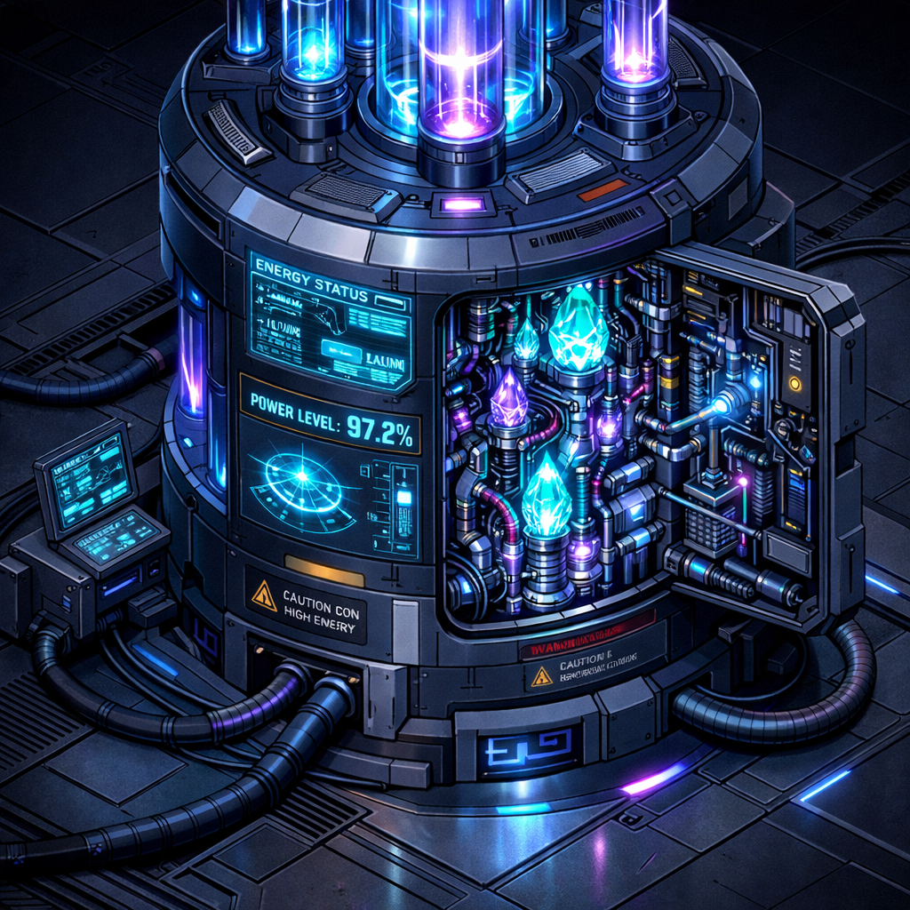

# Advanced Topics

{ align=right width="400" }

Advanced techniques and workflows for power users of site-nine.

## Working with Multiple Agents

The most powerful way to use site-nine is running multiple OpenCode terminals simultaneously, each with a different agent working on related tasks.

### Multi-Terminal Workflow

**Terminal 1 - Administrator:**

Open OpenCode and let the `possession-start` skill run. Select the Administrator role.

**You (in Terminal 1):**
> We need to implement user authentication for the app. Create tasks to break this down into manageable work.

**Mephistopheles (Administrator):**
> I'll break down the authentication feature into tasks across different roles.
> 
> ✓ Created task ARC-H-0001
>   Title: Design authentication architecture and security approach
>   Priority: HIGH
>   Role: Architect
>   Description: Create ADR for auth strategy, choose JWT vs sessions, define security requirements
> 
> ✓ Created task ENG-H-0002
>   Title: Implement authentication API endpoints
>   Priority: HIGH
>   Role: Engineer
>   Dependencies: ARC-H-0001
>   Description: Build login, logout, refresh, and password reset endpoints
> 
> ✓ Created task TST-H-0003
>   Title: Write authentication test suite
>   Priority: HIGH
>   Role: Tester
>   Dependencies: ENG-H-0002
>   Description: Unit and integration tests for all auth flows including edge cases
> 
> ✓ Created task DOC-M-0004
>   Title: Document authentication API
>   Priority: MEDIUM
>   Role: Documentarian
>   Dependencies: ENG-H-0002
>   Description: API documentation with examples for all auth endpoints
> 
> The tasks are ready. I recommend starting with the Architect designing the approach, then handing off to the Engineer.

---

**Terminal 2 - Architect:**

Open a second OpenCode terminal and start a new possession with the Architect role.

**You (in Terminal 2):**
> Claim and work on task ARC-H-0001

**Kothar (Architect):**
> I'll claim ARC-H-0001 and design the authentication architecture.
> 
> ✓ Claimed task ARC-H-0001
> 
> Let me create an Architecture Decision Record...
> 
> ✓ Created `.opencode/planning/ARC-H-0001.md`
> ✓ Created `docs/adr/0003-authentication-strategy.md`
> 
> **Architecture Decision:**
> - Using JWT tokens for stateless authentication
> - Access tokens (15 min expiry) + Refresh tokens (7 day expiry)
> - bcrypt for password hashing
> - Token stored in httpOnly cookies for security
> 
> **Security Requirements:**
> - Rate limiting on login endpoint (5 attempts per 15 min)
> - HTTPS required in production
> - Password requirements: 12+ chars, mixed case, numbers
> 
> The architecture is documented and ready for implementation. Task ARC-H-0001 is complete.

**You (in Terminal 2):**
> Hand this off to an Engineer to implement

**Kothar (Architect):**
> I'll update the handoff for task ENG-H-0002.
> 
> ✓ Updated task ENG-H-0002 status to READY
> ✓ Added handoff notes:
> 
> ```
> Implementation ready - see ADR 0003 for architecture decisions.
> 
> Key implementation points:
> - Use `fastapi-users` library as foundation
> - JWT config in src/config/security.py
> - Auth routes in src/api/auth.py
> - User model needs password_hash field (bcrypt)
> - Add rate limiting middleware
> 
> All design decisions documented in docs/adr/0003-authentication-strategy.md
> ```
> 
> Task ENG-H-0002 is ready for an Engineer to claim.

---

**Terminal 3 - Engineer:**

Open a third OpenCode terminal and start a new possession with the Engineer role.

**You (in Terminal 3):**
> Claim task ENG-H-0002 and implement it based on Kothar's architecture

**Azazel (Engineer):**
> I'll claim ENG-H-0002 and implement the authentication system.
> 
> ✓ Claimed task ENG-H-0002
> 
> Let me review Kothar's ADR first...
> 
> I see the architecture - JWT tokens, bcrypt hashing, rate limiting. I'll implement this now.
> 
> ✓ Created `src/config/security.py` with JWT configuration
> ✓ Created `src/api/auth.py` with endpoints:
>   - POST /auth/login
>   - POST /auth/logout  
>   - POST /auth/refresh
>   - POST /auth/reset-password
> ✓ Updated `src/models/user.py` with password_hash field
> ✓ Added rate limiting middleware in `src/middleware/rate_limit.py`
> ✓ Implemented bcrypt password hashing
> 
> Implementation complete following the ADR specs. Running quick smoke test...
> 
> ✓ Auth endpoints responding correctly
> 
> Task ENG-H-0002 is ready for review. I'll update the status to REVIEW so a Tester can claim TST-H-0003.

---

**Terminal 4 - Tester:**

Open a fourth OpenCode terminal and start a new possession with the Tester role.

**You (in Terminal 4):**
> Claim task TST-H-0003 and test Azazel's authentication implementation

**Eris (Tester):**
> I'll claim TST-H-0003 and write comprehensive tests.
> 
> ✓ Claimed task TST-H-0003
> 
> Let me examine Azazel's implementation and create tests...
> 
> ✓ Created `tests/test_auth.py` with test cases:
>   - test_login_success
>   - test_login_invalid_credentials
>   - test_login_rate_limiting
>   - test_token_refresh
>   - test_expired_token
>   - test_password_reset_flow
> 
> Running test suite...
> 
> ```
> ===== test session starts =====
> tests/test_auth.py::test_login_success ✓
> tests/test_auth.py::test_login_invalid_credentials ✓
> tests/test_auth.py::test_login_rate_limiting ✓
> tests/test_auth.py::test_token_refresh ✓
> tests/test_auth.py::test_expired_token ✓
> tests/test_auth.py::test_password_reset_flow ✓
> 
> ===== 6 passed in 1.8s =====
> ```
> 
> ✅ All tests passing! The authentication implementation is working correctly.
> 
> ✓ Marked task TST-H-0003 as COMPLETE
> ✓ Marked task ENG-H-0002 as COMPLETE
> 
> The authentication feature is tested and validated.

### Benefits of Multi-Terminal Workflow

1. **Parallel Work** - Multiple agents can work on different parts of the system simultaneously
2. **Specialization** - Each agent focuses on their area of expertise
3. **Real-time Coordination** - Agents can reference each other's work
4. **Natural Collaboration** - Mimics how human teams work together

### Coordination Patterns

**Pattern 1: Engineer → Tester Pipeline**

Have an Engineer implement features in one terminal while a Tester writes tests in another terminal, creating a continuous feedback loop.

**Pattern 2: Architect → Engineer Handoff**

Use an Architect to design the system in one terminal, then hand off the specifications to an Engineer in another terminal for implementation.

**Pattern 3: Engineer → Inspector Review**

After an Engineer completes work, bring in an Inspector in a separate terminal to review the code and suggest improvements.

**Pattern 4: Administrator Orchestration**

Keep an Administrator agent running in a dedicated terminal to coordinate tasks, check status, and manage the overall workflow.

## Asking Agents for Project Insights

Instead of querying databases or running commands, ask your agents for insights conversationally.

### Task Analytics

**You:**
> What's our task completion rate?

**Agent (Administrator):**
> Let me check the task analytics...
> 
> **Task Status Breakdown:**
> - COMPLETE: 24 tasks (48%)
> - UNDERWAY: 8 tasks (16%)
> - TODO: 12 tasks (24%)
> - REVIEW: 4 tasks (8%)
> - BLOCKED: 2 tasks (4%)
> 
> Nearly half of all tasks are complete, and only 2 are blocked.

### Agent Activity

**You:**
> Which agents have been most active on this project?

**Agent (Administrator):**
> Here's the agent activity summary:
> 
> | Daemon Name  | Possessions | Completed |
> |--------------|-------------|-----------|
> | Azazel       | 12          | 10        |
> | Eris         | 8           | 7         |
> | Kothar       | 6           | 6         |
> | Nabu         | 4           | 3         |
> 
> Azazel (Inspector) has been the most active, with a strong completion rate.

### Task Dependencies

**You:**
> Show me which tasks are blocking other work

**Agent (Administrator):**
> Let me check the task dependencies...
> 
> **Blocked Tasks:**
> 
> - **ENG-H-0015** (Rate limiting implementation)
>   - Blocked by: ARC-H-0014 (Rate limiting design)
>   - Status: ARC-H-0014 is UNDERWAY, should be ready soon
> 
> - **DOC-H-0018** (API documentation update)
>   - Blocked by: ENG-H-0015, ENG-H-0016, ENG-H-0017
>   - Status: Waiting on 3 Engineer tasks
> 
> The main bottleneck is architectural work. Once ARC-H-0014 completes, several tasks can proceed.

## Custom Templates

Override default agent behavior by customizing templates.

### Customizing Role Instructions

1. Edit the role guide in `.opencode/docs/roles/`:
```bash
# Edit the engineer role guide
$EDITOR .opencode/docs/roles/engineer.md
```

2. Add project-specific guidelines:
```markdown
# Engineer Role

## Project-Specific Guidelines

- Always use TypeScript strict mode
- Follow the established error handling patterns in `src/errors/`
- Run `npm run lint` before marking tasks complete
- Update API documentation in `docs/api/` when adding endpoints

## Standard Guidelines

[... rest of guide ...]
```

3. Agents load these guides automatically during possession initialization.

### Project-Specific Workflows

Create custom workflow documents in `.opencode/procedures/`:

```markdown
# Authentication Implementation Workflow

1. **Design Phase (Architect)**
   - Create ADR for authentication approach
   - Document security requirements
   - Plan token management strategy

2. **Implementation Phase (Engineer)**
   - Implement auth endpoints in `src/api/auth.py`
   - Add middleware to `src/middleware/auth.py`
   - Update user model with password hashing

3. **Testing Phase (Tester)**
   - Write unit tests for auth functions
   - Add integration tests for auth flow
   - Test edge cases (expired tokens, invalid creds)

4. **Documentation Phase (Documentarian)**
   - Document API endpoints
   - Add usage examples
   - Update README with auth setup

5. **Review Phase (Inspector)**
   - Security audit of auth implementation
   - Check for common vulnerabilities
   - Verify password hashing strength
```

Then reference it in conversations:
> Follow the Authentication Implementation Workflow in procedures/

## Task Management Patterns

### Ask Agents to Create Tasks

Instead of using CLI commands, ask agents to create tasks conversationally:

**You:**
> Create a high-priority task for implementing rate limiting on the API

**Agent (Administrator):**
> I'll create that task for you.
> 
> ✓ Created task ENG-H-0015
>   Title: Implement rate limiting on API
>   Priority: HIGH
>   Role: Engineer
>   Status: TODO
> 
> The task is ready for an Engineer to claim.

### Ask Agents About Dependencies

**You:**
> What tasks need to be completed before we can deploy to production?

**Agent (Administrator):**
> Let me check the task dependencies...
> 
> Before deploying to production, these tasks must be complete:
> 
> **Blocking Tasks:**
> 1. TST-H-0012 - Complete integration test suite (IN PROGRESS)
> 2. DOC-H-0008 - Write deployment guide (TODO)
> 3. INS-H-0005 - Security audit (TODO)
> 
> **Recommended:**
> - OPR-M-0003 - Set up monitoring (TODO)
> - DOC-M-0011 - Update API documentation (TODO)
> 
> I recommend completing the blocking tasks first, then reviewing the recommended tasks.

### Break Down Large Features

**You:**
> We need to add a notification system to the app. This seems like a big feature - can you break it down?

**Agent (Administrator):**
> I'll break the notification system into manageable tasks.
> 
> ✓ Created task ARC-H-0020
>   Title: Design notification system architecture
>   Priority: HIGH
>   Role: Architect
>   Description: Choose notification delivery method (websockets, SSE, polling), design data model
> 
> ✓ Created task ENG-H-0021
>   Title: Implement notification backend
>   Priority: HIGH
>   Role: Engineer
>   Dependencies: ARC-H-0020
>   Description: Build notification service, API endpoints, and data storage
> 
> ✓ Created task ENG-H-0022
>   Title: Add notification frontend components
>   Priority: HIGH
>   Role: Engineer
>   Dependencies: ENG-H-0021
>   Description: Create notification UI, toast/banner components, and real-time updates
> 
> ✓ Created task TST-M-0023
>   Title: Test notification delivery
>   Priority: MEDIUM
>   Role: Tester
>   Dependencies: ENG-H-0021, ENG-H-0022
>   Description: Test notification triggers, delivery, UI display, and edge cases
> 
> ✓ Created task DOC-M-0024
>   Title: Document notification system
>   Priority: MEDIUM
>   Role: Documentarian
>   Dependencies: ENG-H-0021
>   Description: API docs, user guide for managing notifications
> 
> I've created 5 tasks with proper dependencies. Start with the Architect designing the system.


### Group Related Tasks with Epics

For large features spanning multiple tasks, use epics to track overall progress:

**You:**
> Create an epic for the notification system work

**Agent (Administrator):**
> I'll create an epic to group these notification tasks.
> 
> ✓ Created epic EPC-H-0005
>   Title: Notification System Implementation
>   Priority: HIGH
>   Status: TODO
> 
> Now I'll link the related tasks to this epic...
> 
> ✓ Linked task ARC-H-0020 to epic EPC-H-0005
> ✓ Linked task ENG-H-0021 to epic EPC-H-0005
> ✓ Linked task ENG-H-0022 to epic EPC-H-0005
> ✓ Linked task TST-M-0023 to epic EPC-H-0005
> ✓ Linked task DOC-M-0024 to epic EPC-H-0005
> 
> The epic is ready! You can track overall progress with `s9 dashboard --epic EPC-H-0005`

**Later, checking progress:**

**You:**
> What's the status of the notification system epic?

**Agent (Administrator):**
> Let me check epic EPC-H-0005...
> 
> **Epic: Notification System Implementation**
> Status: 🚧 UNDERWAY
> Progress: 2/5 tasks complete (40%)
> 
> ✅ **Complete:**
> - ARC-H-0020 - Design architecture (Kothar)
> - ENG-H-0021 - Backend implementation (Azazel)
> 
> 🔄 **In Progress:**
> - ENG-H-0022 - Frontend components (Azazel)
> 
> 📋 **TODO:**
> - TST-M-0023 - Test notification delivery
> - DOC-M-0024 - Document system
> 
> The architecture and backend are done, and the frontend is underway.

**Benefits of using epics:**

1. **Visibility** - See overall feature progress at a glance
2. **Organization** - Group related tasks logically
3. **Auto-status** - Epic status updates automatically as tasks progress
4. **Coordination** - Easier to coordinate work across multiple agents
5. **Tracking** - Track feature completion from start to finish

See the [Epics guide](epics/overview.md) for detailed information on working with epics.

### Check Task Status

**You:**
> What's the status of the authentication feature we've been working on?

**Agent (Administrator):**
> Let me check the authentication tasks...
> 
> **Authentication Feature Status:**
> 
> ✅ **Complete:**
> - ARC-H-0001 - Design auth architecture (Kothar)
> - ENG-H-0002 - Implement auth API (Azazel)
> - TST-H-0003 - Test auth endpoints (Eris)
> 
> 🔄 **In Progress:**
> - DOC-M-0004 - Document auth API (Nabu, 60% complete)
> 
> **Summary:** Core functionality is complete and tested. Documentation is in progress and should be done today.

### Request Task Reassignment

**You:**
> Azazel has been working on ENG-H-0015 for 3 days and seems stuck. Can we reassign it?

**Agent (Administrator):**
> Let me check the task status and reassign if needed...
> 
> Looking at ENG-H-0015 (Rate limiting implementation):
> - Claimed by Azazel 3 days ago
> - Status: UNDERWAY
> - Last update: "Researching best approach for distributed rate limiting"
> 
> This does seem to be taking longer than expected. I'll update the task:
> 
> ✓ Added note: "Consider breaking into smaller tasks - redis setup + rate limit logic"
> ✓ Status changed to TODO
> ✓ Unassigned from Azazel
> 
> The task is now available for another Engineer to claim, or Azazel can reclaim it with a fresh approach.

### Find Related Tasks

**You:**
> What other tasks are related to payment processing?

**Agent (Administrator):**
> Searching for payment-related tasks...
> 
> **Payment Processing Tasks:**
> 
> 🔄 **Active:**
> - ENG-H-0030 - Integrate Stripe payment gateway (Azazel, UNDERWAY)
> - TST-H-0031 - Test payment flows (Eris, TODO, blocked by ENG-H-0030)
> 
> ✅ **Complete:**
> - ARC-H-0028 - Design payment architecture (Kothar)
> - ENG-H-0029 - Create payment data models (Azazel)
> 
> 📋 **Planned:**
> - DOC-M-0032 - Document payment API (TODO)
> - INS-H-0033 - Security audit of payment handling (TODO)
> 
> **Recommendation:** Once ENG-H-0030 is complete, prioritize the security audit before going live.

## Next Steps

- See [Agent Roles](agents/roles.md) for detailed role descriptions
- Check [CLI Reference](cli/overview.md) for available commands
- Review [Directory Structure](structure.md) to understand the .opencode layout

## Future: Agent API vs Human CLI

### The Vision

Currently, both AI agents and humans use the same CLI interface (`s9`). While this works well, there's a potential future enhancement to provide separate, optimized interfaces for each audience:

**Python API for Agents:**
```python
from site_nine.api import Possession, Task

# Type-safe, programmatic interface
possession = Possession.start(
    daemon="cronos",
    role="Operator",
    objective="System improvements"
)

task = Task.claim("OPR-H-0065", possession_id=possession.id)
task.update_status("UNDERWAY")
task.close("COMPLETE")
```

**Rich CLI for Humans:**
```bash
# Interactive, human-friendly commands
s9 dashboard
s9 task next
s9 review approve RVW-001
```

### Benefits of Separation

**For Agents:**
- **Type safety**: Catch errors at development time, not runtime
- **Better error handling**: Structured exceptions instead of parsing output
- **Performance**: Direct database access without subprocess overhead
- **Easier testing**: Mock API calls instead of CLI output
- **IDE support**: Autocomplete, inline documentation, type hints

**For Humans:**
- **Richer output**: Colors, tables, progress bars without worrying about agent parsing
- **Interactive prompts**: Confirmation dialogs, wizards, selection menus
- **Flexible formatting**: Output optimized for readability, not machine parsing
- **Better UX**: Focus on human ergonomics without agent compatibility constraints

### Implementation Strategy

If this separation is pursued in the future:

1. **Phase 1**: Extract core logic into `site_nine.api` module
   - Move business logic from CLI commands to API functions
   - CLI becomes a thin wrapper around the API

2. **Phase 2**: Create Python API for agents
   - Design clean, typed API surface
   - Add comprehensive docstrings
   - Write agent-focused examples

3. **Phase 3**: Enhance CLI for humans
   - Add interactive features
   - Improve output formatting
   - Add confirmation prompts for dangerous operations

4. **Phase 4**: Update agent workflows
   - Migrate agents from CLI to Python API
   - Update possession-start and other skills
   - Deprecate agent use of CLI (keep for backwards compatibility)

### Current Status

This is a **future concept only**. The current unified CLI approach works well and should not be changed without careful consideration. The categorization of commands (agent-primary vs human-primary) in the CLI Reference is sufficient for now and helps both audiences understand the tool's design.

The separation would only be pursued if:
- Agent workflows become significantly more complex
- Performance becomes a bottleneck
- Type safety becomes critical for reliability
- The CLI becomes too constrained by agent compatibility

For now, focus on improving the unified CLI experience and clearly documenting which commands are intended for which audience.
