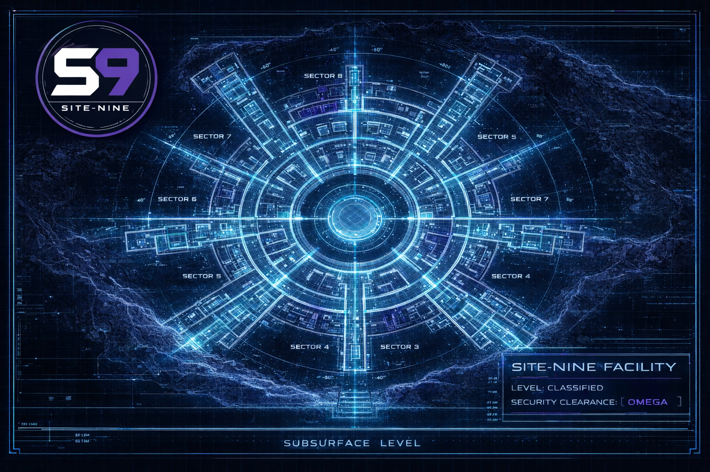

# Glossary

{ align=right width="400" }

A comprehensive reference for key concepts and terminology used throughout site-nine.

---

## Core Concepts

### Persona

A mythology-based name assigned to an AI agent for a specific mission. Each persona represents a unique working session with specialized capabilities based on their assigned role.

**Examples:** Euterpe (Documentarian), Azazel (Engineer), Eris (Tester)

**Key characteristics:**

- Drawn from world mythology (Greek, Norse, Egyptian, Celtic, etc.)
- 145+ names available in the persona database
- Can be reused across multiple missions
- Each active persona works in a separate OpenCode terminal

**Usage:**
```bash
# Suggest persona names for a role
s9 name suggest Documentarian --count 3
```

**See also:** [Role](#role), [Mission](#mission)

---

### Role

A specialized function that defines a persona's capabilities, responsibilities, and area of expertise. Roles determine what type of work a persona is best suited to perform.

**Available roles:**

- **Administrator** - Coordinate and delegate to other agents
- **Architect** - Design systems and make technical decisions
- **Engineer** (formerly Builder) - Implement features and write code
- **Tester** - Write tests and validate functionality
- **Documentarian** - Create documentation and guides
- **Designer** - Design user interfaces and experiences
- **Historian** - Document project history and decisions
- **Inspector** - Review code and audit security
- **Operator** - Deploy systems and manage infrastructure

**Key characteristics:**

- Each role has specialized knowledge and best practices
- Tasks are assigned to specific roles
- Multiple personas can share the same role
- Role determines default workflows and priorities

**Usage:**
```bash
# Start a mission with a specific role
/summon documentarian

# View role-filtered dashboard
s9 dashboard --role Engineer
```

**See also:** [Persona](#persona), [Task](#task), [Agent Roles documentation](agents/roles.md)

---

### Mission

A working session where a persona (AI agent) actively works on project tasks. Each mission has a unique identifier, objective, and tracks the persona's activities.

**Mission lifecycle:**

1. **Start** - Persona is summoned and mission begins
2. **Active** - Persona works on tasks and makes changes
3. **Idle** - Mission exists but persona is not actively working
4. **Complete** - Mission ends and work is documented

**Key characteristics:**

- Each mission gets a unique codename
- Tracked in the database with status, start time, and objective
- Generates a mission file at `.opencode/work/missions/YYYY-MM-DD.HH:MM:SS.role.persona.codename.md`
- Can be paused (IDLE) and resumed
- Multiple missions can run in parallel (different terminals)

**Usage:**
```bash
# Start a new mission
s9 mission start euterpe --role Documentarian --task "Create glossary"

# List active missions
s9 mission list --status ACTIVE

# End a mission
s9 mission end <mission-id>
```

**See also:** [Persona](#persona), [Session](#session), [Codename](#codename)

---

### Task

A discrete unit of work with a specific objective, priority, assigned role, and tracked status. Tasks are the fundamental building blocks of project management in site-nine.

**Task components:**

- **Task ID** - Unique identifier (e.g., `DOC-M-0056`)
- **Title** - Brief description of the work
- **Description** - Detailed context and requirements
- **Role** - Which type of persona should handle this
- **Priority** - CRITICAL, HIGH, MEDIUM, or LOW
- **Status** - Current state (TODO, UNDERWAY, BLOCKED, etc.)
- **Dependencies** - Other tasks that must complete first
- **Epic** - Optional parent epic for grouping

**Task statuses:**

- **TODO** - Ready to be claimed
- **UNDERWAY** - Actively being worked on
- **BLOCKED** - Waiting on dependencies or external factors
- **REVIEW** - Work complete, awaiting review
- **PAUSED** - Temporarily suspended
- **COMPLETE** - Successfully finished
- **ABORTED** - Cancelled or no longer needed

**Usage:**
```bash
# Create a task
s9 task create --title "Create glossary" --role Documentarian --priority MEDIUM

# Claim a task
s9 task claim DOC-M-0056

# Show task details
s9 task show DOC-M-0056

# Close a task
s9 task close DOC-M-0056 --status COMPLETE
```

**See also:** [Epic](#epic), [Task ID](#task-id), [Priority](#priority), [Status](#status)

---

### Epic

An organizational container that groups related tasks under a larger initiative or feature. Epics help track overall progress for complex projects spanning multiple tasks and roles.

**Key characteristics:**

- **Purely organizational** - Not assigned to specific personas
- **One task, one epic** - Tasks belong to at most one epic
- **Auto-computed status** - Updates automatically based on subtask states
- **Progress tracking** - Shows completion percentage and task breakdown
- **Database-driven** - Stored in database, markdown files are generated artifacts

**Epic lifecycle:**

1. **Create** - Define epic with title and priority
2. **Link tasks** - Add new or existing tasks to the epic
3. **Track progress** - Monitor as tasks are completed
4. **Complete** - Automatically marked when all tasks finish
5. **Abort** - Manually cancel if requirements change

**Epic statuses:**

- **TODO** (📋) - All subtasks are TODO or ABORTED
- **UNDERWAY** (🚧) - At least one subtask is being worked on
- **COMPLETE** (✅) - All subtasks completed
- **ABORTED** (❌) - Manually cancelled, subtasks also aborted

**Usage:**
```bash
# Create an epic
s9 epic create --title "User Authentication System" --priority HIGH

# Link tasks to epic
s9 task create --title "Design auth flow" --role Architect --epic EPC-H-0001
s9 task link ARC-H-0015 EPC-H-0001

# View epic progress
s9 epic show EPC-H-0001
s9 dashboard --epic EPC-H-0001

# Abort an epic
s9 epic abort EPC-H-0001 --reason "Requirements changed"
```

**See also:** [Task](#task), [Epic ID](#epic-id), [Epics documentation](epics/overview.md)

---

### Handoff

A mechanism for transferring work context from one persona to another, ensuring continuity and knowledge sharing across role boundaries.

**Handoff workflow:**

1. **Create** - Originating persona creates handoff with context
2. **Pending** - Handoff awaits acceptance by target role
3. **Accept** - Receiving persona accepts and claims the work
4. **Complete** - Work transition is finished

**Key characteristics:**

- Includes task information, context, and notes
- Filtered by role (e.g., only Engineers see Engineer handoffs)
- Checked automatically during mission start
- Ensures smooth transitions between specialized roles

**Usage:**
```bash
# Create a handoff for a task
s9 handoff create TSK-H-0042 --role Engineer --message "Ready for implementation"

# List pending handoffs for your role
s9 handoff list --role Engineer --status pending

# Accept a handoff
s9 handoff accept <handoff-id>

# Show handoff details
s9 handoff show <handoff-id>
```

**See also:** [Role](#role), [Task](#task), [Review](#review)

---

### Review

A quality assurance process where completed work is evaluated before being marked as complete. Reviews ensure code quality, adherence to standards, and catch issues early.

**Review workflow:**

1. **Create** - Task owner requests review
2. **Pending** - Awaiting reviewer action
3. **Approved** - Reviewer accepts the work
4. **Changes requested** - Reviewer identifies issues to fix
5. **Complete** - Review process finished

**Key characteristics:**

- Typically handled by Administrator or Inspector roles
- Can block task completion until approved
- Includes comments and feedback
- Part of quality control process

**Usage:**
```bash
# Create a review request
s9 review create TSK-H-0042 --message "Ready for review"

# List pending reviews
s9 review list --status pending

# Approve a review
s9 review approve <review-id> --comment "Looks good!"

# Request changes
s9 review request-changes <review-id> --comment "Please add tests"
```

**See also:** [Task](#task), [Status](#status)

---

## Identifiers

### Task ID

A structured identifier that uniquely identifies a task and encodes its role and priority.

**Format:** `[ROLE]-[PRIORITY]-[NUMBER]`

**Components:**

- **ROLE** - 3-letter role prefix:
    - `ADM` - Administrator
    - `ARC` - Architect  
    - `ENG` - Engineer (formerly Builder)
    - `TST` - Tester
    - `DOC` - Documentarian
    - `DSN` - Designer
    - `HST` - Historian
    - `INS` - Inspector
    - `OPR` - Operator
- **PRIORITY** - Single letter:
    - `C` - CRITICAL
    - `H` - HIGH
    - `M` - MEDIUM
    - `L` - LOW
- **NUMBER** - Sequential 4-digit number (zero-padded)

**Examples:**

- `DOC-M-0056` - Documentarian task, MEDIUM priority, #56
- `ENG-H-0002` - Engineer task, HIGH priority, #2
- `TST-C-0001` - Tester task, CRITICAL priority, #1

**Benefits:**

- Easy to identify role and priority at a glance
- Sortable and filterable
- Human-readable in logs and commit messages

**See also:** [Task](#task), [Epic ID](#epic-id), [Role](#role), [Priority](#priority)

---

### Epic ID

A structured identifier for epics, similar to Task IDs but with an "EPC" prefix.

**Format:** `EPC-[PRIORITY]-[NUMBER]`

**Components:**

- `EPC` - Epic prefix (constant)
- **PRIORITY** - Single letter (C/H/M/L)
- **NUMBER** - Sequential 4-digit number

**Examples:**

- `EPC-H-0001` - First HIGH priority epic
- `EPC-C-0015` - Epic #15 with CRITICAL priority
- `EPC-M-0042` - Epic #42 with MEDIUM priority

**See also:** [Epic](#epic), [Task ID](#task-id)

---

### Codename

A randomly generated, memorable identifier assigned to each mission for easy reference and session naming.

**Characteristics:**

- Auto-generated when mission starts
- Unique per mission
- Used in mission filenames
- Appears in OpenCode session titles

**Examples:** phoenix-delta, nebula-seven, thunder-alpha

**See also:** [Mission](#mission)

---

## Status Values

### Status

The current state of a task, indicating its progress through the workflow.

**Task statuses:**

| Status | Symbol | Description |
|--------|--------|-------------|
| TODO | ⬜ | Ready to be claimed and started |
| UNDERWAY | 🔵 | Actively being worked on |
| BLOCKED | 🔴 | Waiting on dependencies or external factors |
| REVIEW | 🟡 | Work complete, awaiting review |
| PAUSED | ⏸️ | Temporarily suspended |
| COMPLETE | ✅ | Successfully finished |
| ABORTED | ❌ | Cancelled or no longer needed |

**Epic statuses:**

| Status | Symbol | Description |
|--------|--------|-------------|
| TODO | 📋 | All subtasks TODO or ABORTED |
| UNDERWAY | 🚧 | At least one subtask in progress |
| COMPLETE | ✅ | All subtasks completed |
| ABORTED | ❌ | Manually cancelled |

**Mission statuses:**

| Status | Description |
|--------|-------------|
| ACTIVE | Persona currently working |
| IDLE | Mission exists but not actively working |
| COMPLETE | Mission ended, work documented |

**See also:** [Task](#task), [Epic](#epic), [Mission](#mission)

---

### Priority

A ranking that indicates the urgency and importance of tasks and epics, helping teams focus on critical work first.

**Priority levels:**

| Priority | Symbol | When to use |
|----------|--------|-------------|
| CRITICAL | 🔴 | Urgent blockers, production issues, critical path items |
| HIGH | 🟠 | Important features, significant bugs, deadline-driven work |
| MEDIUM | 🟡 | Standard features, improvements, technical debt |
| LOW | 🟢 | Nice-to-have features, minor improvements, future work |

**Priority in IDs:**

- Encoded in Task IDs and Epic IDs as a single letter (C/H/M/L)
- Makes priority visible at a glance
- Used for sorting and filtering

**Best practices:**

- Not everything can be CRITICAL - use sparingly
- HIGH priority for features on current milestone
- MEDIUM for planned work in the backlog
- LOW for speculative or future improvements

**See also:** [Task](#task), [Epic](#epic), [Task ID](#task-id)

---

## System Components

### Dashboard

A real-time project overview showing active missions, task summaries, epic progress, and quick statistics.

**Information displayed:**

- **Quick Stats** - Active missions, total tasks, completion rates
- **Active Epics** - Top epics in TODO/UNDERWAY status
- **Active Missions** - Currently running personas and their work
- **Task Summary** - Tasks by status and priority
- **Recent Activity** - Latest task updates

**Dashboard views:**

```bash
# Full project dashboard
s9 dashboard

# Epic-specific view
s9 dashboard --epic EPC-H-0001

# Role-filtered view
s9 dashboard --role Documentarian
```

**Use cases:**

- Check project health at a glance
- See what personas are working on
- Identify bottlenecks and blocked work
- Track epic and task progress
- Start of day project status review

**See also:** [Mission](#mission), [Epic](#epic), [Task](#task)

---

### Session

An OpenCode conversation instance where a persona works on tasks. Each session corresponds to one OpenCode terminal window.

**Key characteristics:**

- One session = one OpenCode terminal
- Sessions can be named/renamed for organization
- Multiple sessions can run in parallel
- Each session has one active persona/mission
- Session title includes persona name and role

**Session naming:**

When a mission starts, the OpenCode session is automatically renamed to:
```
<Persona> - <Role>
```

Example: `Euterpe - Documentarian`

**Multi-session workflows:**

Run multiple personas simultaneously in separate terminals:
- Terminal 1: Administrator coordinating work
- Terminal 2: Architect designing system
- Terminal 3: Engineer implementing features
- Terminal 4: Tester validating implementation

**See also:** [Mission](#mission), [Persona](#persona), [Advanced Topics documentation](advanced.md)

---

### Database

A SQLite database (`.opencode/data/project.db`) that stores all project management data including tasks, missions, personas, epics, and relationships.

**Database tables:**

- `personas` - Available persona names and usage tracking
- `missions` - Mission history and status
- `tasks` - Task definitions and metadata
- `epics` - Epic definitions and progress
- `dependencies` - Task dependency relationships
- `handoffs` - Work transfer records
- `reviews` - Review requests and outcomes

**Important notes:**

- **Never edit directly** - Always use `s9` CLI commands
- Database is the source of truth
- Markdown files are generated from database
- Backed up with `.db-journal` and `.db-wal` files

**Database health:**

```bash
# Check database integrity
s9 doctor

# Fix common issues
s9 doctor --fix
```

**See also:** [.opencode Directory](#opencode-directory), [Directory Structure documentation](structure.md)

---

### .opencode Directory

The project directory created by `s9 init` that contains all site-nine configuration, data, and documentation.

**Directory structure:**

```
.opencode/
├── README.md              # Setup guide
├── data/                  # Database and storage
│   └── project.db         # SQLite database
├── guides/                # Reference documentation
│   └── PERSONAS.md        # Persona workflow guide
├── procedures/            # Workflow documentation
│   ├── COMMIT_GUIDELINES.md
│   └── TASK_WORKFLOW.md
├── tasks/                 # Task markdown files
├── work/                  # Active work artifacts
│   ├── missions/          # Mission documentation
│   └── epics/             # Epic markdown files
└── missions/              # Historical mission logs
```

**What you can edit:**

- `README.md` - Customize for your team
- `guides/*.md` - Add team-specific documentation
- `procedures/*.md` - Customize workflows

**What not to edit:**

- `data/project.db` - Use CLI commands instead
- `tasks/*.md` - Synced with database
- `work/missions/*.md` - Managed by personas
- `missions/*` - Historical logs

**See also:** [Database](#database), [Directory Structure documentation](structure.md)

---

## Workflow Concepts

### Dependency

A relationship between tasks where one task must be completed before another can begin. Dependencies ensure work happens in the correct order.

**Key characteristics:**

- One-to-many: One task can have multiple dependencies
- Blocking: Tasks with incomplete dependencies are BLOCKED
- Visible in dashboard and task details
- Used for planning and sequencing work

**Usage:**
```bash
# Add a dependency (ENG-H-0016 depends on ARC-H-0015)
s9 task add-dependency ENG-H-0016 ARC-H-0015

# Remove a dependency
s9 task remove-dependency ENG-H-0016 ARC-H-0015

# View task dependencies
s9 task show ENG-H-0016
```

**Common patterns:**

- Architecture → Implementation → Testing → Documentation
- Design → Frontend → Backend → Integration
- Planning → Development → Review → Deployment

**See also:** [Task](#task), [Status](#status)

---

### Claim

The action of a persona taking ownership of a task, indicating they will work on it.

**Claim workflow:**

1. **View available tasks** - Check dashboard or task list
2. **Claim task** - Persona takes ownership
3. **Status changes** - Task moves from TODO to UNDERWAY
4. **Work begins** - Persona starts implementation
5. **Complete task** - Persona closes task when done

**Usage:**
```bash
# Claim a task
s9 task claim DOC-M-0056

# Unclaim if needed
s9 task unclaim DOC-M-0056
```

**Best practices:**

- Claim tasks appropriate for your role
- Don't claim more tasks than you can actively work on
- Update task status as work progresses
- Unclaim if you can't complete the task

**See also:** [Task](#task), [Status](#status)

---

### Changelog

A generated report of completed tasks, organized by date and role, suitable for release notes or project updates.

**Output formats:**

- **Markdown** - Human-readable format for documentation
- **JSON** - Machine-readable format for processing

**Usage:**
```bash
# Generate full changelog
s9 changelog

# Only recent changes
s9 changelog --since 2026-01-01

# Write to file
s9 changelog --output CHANGELOG.md

# JSON format
s9 changelog --format json --output changelog.json
```

**Example output:**
```markdown
# Changelog

## 2026-02-04

### Documentarian
- DOC-M-0056: Create glossary page in docs/

### Engineer
- ENG-H-0002: Implement authentication API endpoints

## 2026-02-03

### Tester
- TST-H-0003: Write authentication test suite
```

**See also:** [Task](#task), [Historian Role](agents/roles.md#historian)

---

### ADR (Architecture Decision Record)

A document that captures an important architectural decision along with its context and consequences. ADRs are typically created by Architect personas.

**ADR structure:**

- **Title** - The decision made
- **Status** - Proposed, Accepted, Deprecated, Superseded
- **Context** - What led to this decision
- **Decision** - What was chosen and why
- **Consequences** - Impact and trade-offs

**Where stored:**

Typically in `docs/adr/` or `.opencode/planning/`, following a numbering convention like:
- `0001-use-jwt-tokens.md`
- `0002-choose-database-postgres.md`

**See also:** [Architect Role](agents/roles.md#architect)

---

## Operations

### s9 CLI

The command-line interface for interacting with site-nine, providing commands for tasks, missions, epics, personas, and project management.

**Command categories:**

- **Initialization** - `s9 init`, `s9 doctor`
- **Project overview** - `s9 dashboard`, `s9 changelog`
- **Task management** - `s9 task create|claim|show|close|list`
- **Epic management** - `s9 epic create|show|list|abort|sync`
- **Mission management** - `s9 mission start|end|list|update`
- **Persona operations** - `s9 name suggest|claim|release`
- **Handoffs** - `s9 handoff create|list|accept|show`
- **Reviews** - `s9 review create|list|approve`

**Getting help:**
```bash
# General help
s9 --help

# Command-specific help
s9 task --help
s9 epic create --help
```

**See also:** [CLI Reference documentation](cli/overview.md)

---

### /summon Command

An OpenCode slash command that starts a new mission by initializing a persona with a specific role.

**Usage patterns:**

```bash
# Interactive - prompts for role and persona selection
/summon

# With role specified
/summon documentarian
/summon engineer
/summon tester

# With auto-naming (future feature)
/summon operator --auto-name
```

**What it does:**

1. Shows project dashboard
2. Prompts for role selection (if not provided)
3. Suggests persona names from mythology
4. Registers mission in database
5. Renames OpenCode session
6. Checks for pending handoffs
7. Shows role-specific dashboard
8. Ready to work!

**See also:** [Mission](#mission), [Persona](#persona), [Role](#role)

---

## Best Practices

### Mission File

A markdown file automatically generated for each mission that documents the persona's work, decisions, and progress.

**Location:** `.opencode/work/missions/YYYY-MM-DD.HH:MM:SS.role.persona.codename.md`

**Contents:**

- Mission metadata (persona, role, objective, start time)
- Work summary and accomplishments
- Decisions made
- Files changed
- Tasks claimed and completed
- Notes and context

**Management:**

- Auto-generated when mission starts
- Updated by persona throughout mission
- Moved to `.opencode/missions/` when mission ends
- Provides historical record of work

**See also:** [Mission](#mission), [Persona](#persona)

---

### Commit Message

Git commit messages in site-nine projects typically include persona or mission identification for traceability.

**Recommended formats:**

```bash
# With persona name and role
[Persona: Euterpe - Documentarian] Add glossary page to docs

# With mission codename
[Mission: phoenix-delta] Implement user authentication

# Standard format for clarity
<type>: <description>

[Persona: <name> - <role>]
<optional detailed body>
```

**Common types:**

- `feat` - New feature
- `fix` - Bug fix
- `docs` - Documentation changes
- `refactor` - Code refactoring
- `test` - Adding or updating tests
- `chore` - Maintenance tasks

**See also:** `.opencode/procedures/COMMIT_GUIDELINES.md`

---

## Troubleshooting

### Doctor Command

A diagnostic tool that checks database integrity, validates relationships, and identifies common issues.

**Usage:**
```bash
# Run health checks
s9 doctor

# Show detailed output
s9 doctor --verbose

# Automatically fix safe issues
s9 doctor --fix
```

**What it checks:**

- Database integrity
- Invalid foreign key references
- Inconsistent task states
- Orphaned dependencies
- Missing referenced files
- Mission data issues

**See also:** [Database](#database), [CLI Reference](cli/overview.md)

---

## Related Documentation

For more detailed information on specific topics:

- **[Quickstart Guide](quickstart.md)** - Get started in 5 minutes
- **[Agent Roles](agents/roles.md)** - Detailed role descriptions and best practices
- **[Directory Structure](structure.md)** - Understanding the .opencode directory
- **[Epics](epics/overview.md)** - Complete guide to epic workflow
- **[Advanced Topics](advanced.md)** - Multi-persona workflows and patterns
- **[CLI Reference](cli/overview.md)** - Complete command documentation

---

## Mythology References

site-nine uses names from world mythology for personas, drawing from diverse cultural traditions:

**Mythological traditions included:**

- **Greek** - Zeus, Athena, Hermes, Euterpe, etc.
- **Norse** - Odin, Thor, Loki, Freya, etc.
- **Egyptian** - Ra, Thoth, Anubis, Isis, etc.
- **Celtic** - Brigid, Cernunnos, Morrigan, etc.
- **Mesopotamian** - Marduk, Ishtar, Gilgamesh, etc.
- **Hindu** - Brahma, Vishnu, Shiva, Lakshmi, etc.
- **Japanese** - Amaterasu, Susanoo, Inari, etc.
- **And many more...**

**Why mythology?**

- Memorable and distinctive names
- Rich cultural heritage
- Easier to remember than IDs or random strings
- Adds personality to the workflow
- 145+ unique names ensure variety

**See also:** `.opencode/guides/PERSONAS.md`
