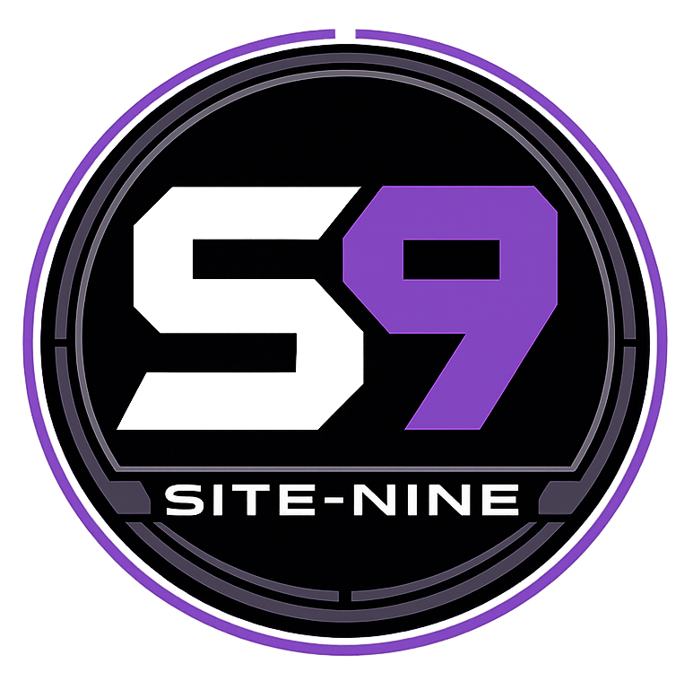

{ .s9-logo }

The headquarters for AI agent orchestration

## Overview

**site-nine** is an orchestration framework designed to work with [OpenCode](https://github.com/khulnasoft/opencode) for AI-assisted software development. Work naturally with specialized AI agents through conversation, while site-nine handles project coordination behind the scenes.

site-nine provides:

- **Possession Tracking** - Track which agents are working on what, with specialized roles (Engineer, Tester, Architect, etc.)
- **Task Management System** - SQLite-based project management with priorities and dependencies
- **Daemon System** - 145+ mythology-based daemon names for agent identity
- **Multi-Agent Workflows** - Run multiple specialized agents in parallel OpenCode terminals
- **Dashboard** - Real-time project overview

## How It Works

1. Initialize site-nine in your project: `s9 init`
2. Summon an agent directly: `s9 summon operator` (or any role)
3. Talk to your agents naturally - they handle tasks, write code, run tests, and coordinate with each other
4. Run multiple agents in parallel terminals for complex workflows

## Quick Links

- [Quickstart Guide](quickstart.md) - Get started in 5 minutes
- [Working with Agents](agents/overview.md) - Learn about the agent system
- [Advanced Topics](advanced.md) - Multi-agent workflows and patterns
- [CLI Reference](cli/overview.md) - Complete command documentation
- [GitHub Repository](https://github.com/dusktreader/site-nine)

## Requirements

- Python 3.12 or later
- [OpenCode](https://github.com/khulnasoft/opencode) - AI coding assistant
- Modern terminal with Unicode support (for rich output)

## License

MIT License - See LICENSE.md for details